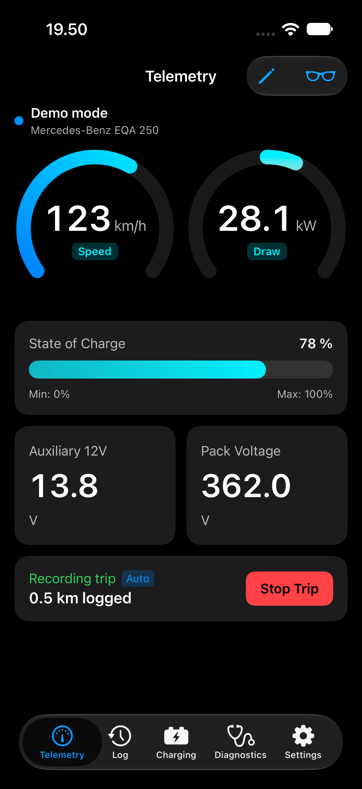
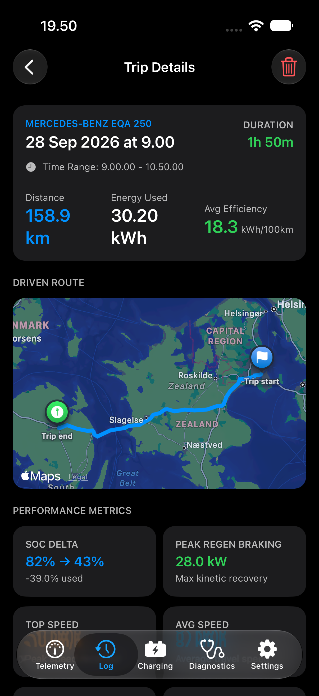
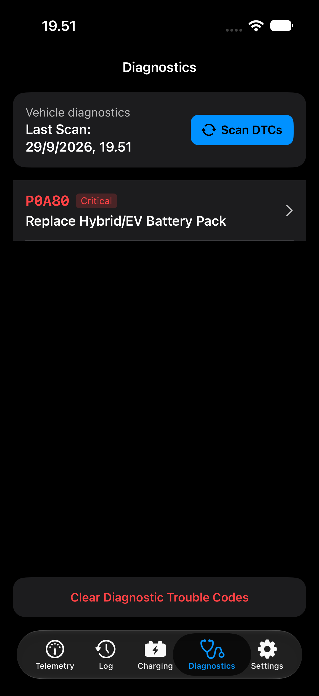

# VoltLink — Swift iOS OBD-II & EV Telemetry App

[](https://apple.com)
[](https://apple.com)
[](https://swift.org)
[](https://developer.apple.com/swift/)

**VoltLink** is a modern, high-performance native iOS & Apple CarPlay diagnostic and live telemetry suite built with **SwiftUI**, **CoreBluetooth**, **CarPlay**, **Swift Charts**, and **SwiftData**.

Engineered for Bluetooth Low Energy (BLE) OBD-II adapters—specifically optimized for the **Vgate iCar Pro 2S**—VoltLink delivers real-time Unified Diagnostic Services (UDS) telemetry for electric vehicles (including the **Mercedes-Benz EQA 250**, **Volkswagen MEB platform**, and **Hyundai/Kia E-GMP**), alongside standard SAE J1979 OBD-II fallback and a physics-based **Demo / Simulation Engine**.

---

## 📸 App Showcase

<div align="center">

|                                Live Telemetry Dashboard                                |                                   VoltLink Trip History                                   |                          ECU Fault Code Diagnostics Display                          |
| :------------------------------------------------------------------------------------: | :---------------------------------------------------------------------------------------: | :----------------------------------------------------------------------------------: |
|  |  |  |
|               _Real-time speed, power arc, SOC % & Swift Charts stream_                |                _ECU fault scanner with severity rating & Mode 04 clearing_                |                    _Glanceable 4-widget CarPlay driver dashboard_                    |

</div>

---

## 🚀 Quick Start Guide

### Prerequisites

- **macOS Sonoma / Sequoia** with **Xcode 15.0+** or **Xcode 16.0+**
- **iOS 17.0+** iPhone or Simulator
- Optional: **Vgate iCar Pro 2S (BLE)** OBD-II adapter (or use built-in **Demo Mode**)

---

### Option 1: Running & Building via Terminal (CLI)

#### 1. Building for iOS Simulator via Terminal

You can build the iOS app directly from terminal using `xcodebuild`:

```bash
xcodebuild -scheme VoltLink -destination 'platform=iOS Simulator,name=iPhone 17'
```

#### 2. Launching the iOS Simulator from Terminal

```bash
# Open macOS Simulator app
open -a Simulator

# Boot a specific iPhone simulator
xcrun simctl boot "iPhone 17"
```

#### 3. Running Unit Tests via Terminal

```bash
# Run unit test suite via SwiftPM
swift test
```

---

### Option 2: Running in Xcode (GUI)

1. **Open the Project in Xcode**:

   ```bash
   open VoltLink.xcodeproj
   ```

2. **Select Target & Destination**:
   - Make sure **VoltLink** is selected in the top scheme bar.
   - Select your desired **iOS Simulator** (e.g. **iPhone 17**).

3. **Run the App (`Cmd + R`)**:
   - Xcode will compile `VoltLink.app` and launch it directly in your Simulator!

4. **Build & Run**:
   Press `Cmd + R` to build and launch the application.

5. **Testing Apple CarPlay**:
   While the iOS Simulator is running:
   - In the Simulator menu, go to **I/O -> External Displays -> CarPlay**.
   - A secondary CarPlay display window will open running the native VoltLink CarPlay dashboard!

---

## ⚡ Features & How to Use

### 📱 Live Telemetry Dashboard

- **Speed & Power Gauge**: Circular arc displaying live power draw ($kW$) and regenerative braking (emerald green arc).
- **Battery Pack Monitor**: High Voltage Battery State of Charge (SOC %), State of Health (SOH %), pack temperature, and 12V auxiliary battery voltage.
- **Swift Charts Stream**: Real-time line graph plotting power and speed telemetry.
- **Head-Up Display (HUD) Mode**: Tap the sunglasses icon in the top header to enter mirrored windshield reflection mode for night driving.

---

### 🎮 Demo / Simulation Mode (No Adapter Required!)

Don't have an OBD-II adapter nearby? No problem!

1. VoltLink starts in **Demo Mode** by default.
2. Tap the **Controls** button in the header bar to open the **Demo Control Sheet**.
3. Choose preset scenarios:
   - **City Drive**: Automatic stop-and-go driving with regenerative braking.
   - **Highway Cruise**: High-speed 120 km/h cruising.
   - **DC Fast Charging**: Simulates 100 kW DC fast-charging curve for the EQA 250.
   - **Diagnostic Fault Injection**: Simulates test fault code `P0A80` (Replace EV Battery Pack).
4. Use manual sliders to dynamically adjust simulated vehicle speed and regen force in real-time.

---

### 🔍 Diagnostics & DTC Code Scanner

1. Navigate to the **Diagnostics** tab.
2. Tap **Scan DTCs** to read active and pending fault codes from vehicle ECUs.
3. Tap any code to inspect detailed severity ratings, symptoms, and repair recommendations.
4. Tap **Clear Diagnostic Trouble Codes** to send Mode 04 code clearance commands.

---

### 🚗 Apple CarPlay Support

- When connected to CarPlay, VoltLink displays a 4-widget glanceable dashboard:
  - Live Battery SOC %
  - Realtime Power kW draw/regen
  - Vehicle Speed
  - System Health Status

---

## 🛠️ Architecture & Tech Stack

- **UI Framework**: SwiftUI + Swift Charts + SF Symbols 5/6
- **BLE Communications**: CoreBluetooth (`CBCentralManager`) + ISO-TP CAN Frame Assembler (`ISO15765Parser`)
- **Vehicle Profiles**: Mercedes EQA 250 UDS (ISO 14229 Service 22) PIDs + Generic SAE J1979 Mode 01–0A
- **CarPlay**: `CPTemplateApplicationSceneDelegate` + `CPGridTemplate`
- **Dynamic Island**: ActivityKit (`VoltLinkActivityAttributes`)
- **Persistence**: SwiftData (`TripModel`, `ChargingSessionModel`, `SavedDTCModel`)
